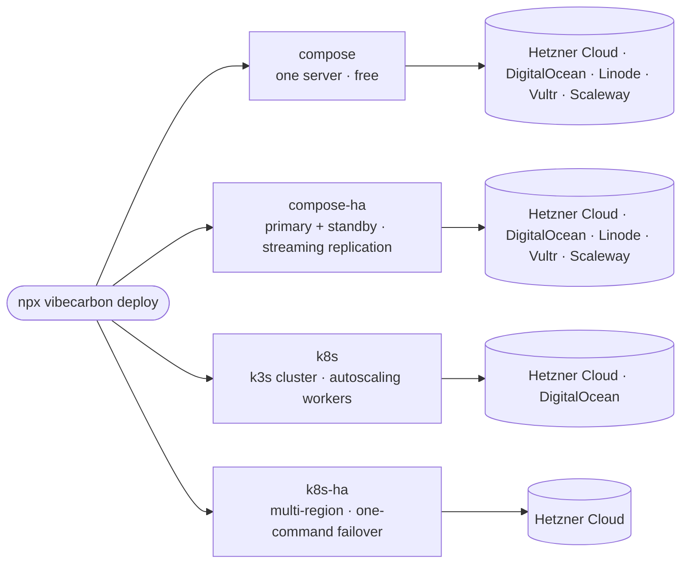

<p align="center">
  <picture>
    <source media="(prefers-color-scheme: dark)" srcset="https://raw.githubusercontent.com/hyperformant/vibecarbon/main/docs/assets/banner-dark.svg">
    
  </picture>
</p>

<p align="center"><strong>Idea to launch in minutes, with auth, billing, email, templates, and more.</strong></p>

<p align="center">Advanced DevOps CLI for multiple hosting providers: deploy, scale, backup, restore, and failover with simple commands.</p>

<p align="center">
  <a href="https://www.npmjs.com/package/vibecarbon"></a>
  <a href="./LICENSE"></a>
</p>

<p align="center">
  <a href="#quick-start">Quick Start</a> ·
  <a href="#commands">Commands</a> ·
  <a href="#key-benefits">Benefits</a> ·
  <a href="#performance">Performance</a> ·
  <a href="#license--terms">License</a>
</p>

---

## What is Vibecarbon?

Vibecarbon is a full-stack SaaS starter that combines React 19, Vite, Tailwind v4, Hono, and self-hosted Supabase, with automated DevOps built in.

Skip the choice between vendor lock-in and DIY infrastructure. Ship an application with authentication, billing, teams, email, blog, docs, and i18n already wired up, then put it in production without a dedicated DevOps engineer.

Vibecarbon handles Docker Compose and Kubernetes, high availability with one-command failover, worker scaling, and automated backups. The complete stack stays self-contained under one flag you chose, yours to keep, move, or delete. Choose the provider underneath, and choose again whenever you want: your infrastructure choice stays reversible.

---

## Four Commitments, Enforced by Design

**Sovereign** · Privacy within borders
Full-stack self-contained. Infrastructure, code, data, and integrations under your complete control.

**Agnostic** · Modular and portable
Swap components, move hosting providers. All the batteries included, but easily changed.

**Grounded** · Rooted in transparency
Fair Source CLI, Open Source Templates. Everything transparent all the way down.

**Agentic** · AI-native guardrails
Security and governance built in. Architected for software built by agents.

---

## Quick Start

**Prerequisites**

- **Node.js 24.15+** and **Docker** for `create` and local development (`up`).
- **[Pulumi CLI](https://www.pulumi.com/docs/install/)** is required for any cloud deploy (`curl -fsSL https://get.pulumi.com | sh`). It is not bundled.
- **`kubectl` + `helm`** additionally for the `k8s` / `k8s-ha` modes.
- **Linux, macOS, or Windows via [WSL2](https://learn.microsoft.com/en-us/windows/wsl/install)**. Native Windows is not supported.

```bash
# Create a new project
npx vibecarbon create my-app

# Start local development
cd my-app
npx vibecarbon up

# Deploy an environment
npx vibecarbon deploy

# Tear down an environment
npx vibecarbon destroy
```

---

## Commands

```text
USAGE
  npx vibecarbon <command> [options]

DEV COMMANDS
  create <project-name>    Create a new Vibecarbon project
  up                       Start local development environment
  down                     Stop local development environment
  status                   Show project and deployment status
  reset                    Reset local environment (removes all data)
  configure                Configure external services and project settings (billing, OAuth, SMTP, CI/CD, globalization, etc.)
  add <feature>            Add features (observability, redis)
  remove <feature>         Remove features from a project
  upgrade                  Upgrade infrastructure files to latest template

DEPLOY COMMANDS
  deploy [environment]     Deploy an environment (interactive picker for mode/region)
  destroy [environment]    Tear down cloud environment
  backup [environment]     Create, list, or download database backups
  restore [environment]    Restore database from backup
  failover [environment]   Initiate failover to standby region
  scale [environment]      Scale worker nodes and instance sizes

LICENSE COMMANDS
  activate [key]           Activate a Fullerene license key (unlocks HA + k8s modes)
  deactivate               Deactivate the current license

DEBUG COMMANDS
  shell [environment]      Interactive bash with KUBECONFIG + cloud creds exported
  diagnose [environment]   Dump full cluster state to ~/.vibecarbon/diag-*
  console <node>           Open Hetzner's web VNC console for a node
  access [subcommand]      Manage SSH + k8s-API operator-CIDR allowlist
```

---

## Who It's For

**Indie Hackers & Solopreneurs**
Ship fast and control the whole stack. Launch a production-grade MVP this weekend.

**Startup Founders & Small Teams**
Multi-tenant organizations, auto-scaling, and high availability when you need it, without a dedicated DevOps engineer.

**Agencies & Consultancies**
One stack for every client project. Consistent, production-ready foundation with easy handoff.

---

## Where Vibecarbon Fits

If you already self-host with tools like [Coolify](https://coolify.io) or [Dokploy](https://dokploy.com), Vibecarbon lives in the same world: the stack, the state, and the data are yours, with no platform lock-in. The difference is where it starts.

| | You bring | You get |
|---|---|---|
| **Coolify / Dokploy** | An app you've already built | A self-hosted PaaS dashboard that deploys it |
| **Vibecarbon** | An idea | The SaaS codebase itself (auth, billing, teams, admin) plus a CLI that deploys and operates it across Hetzner, DigitalOcean, Linode, Vultr, or Scaleway, from a single Docker Compose server to Kubernetes with one-command failover (mode support varies by provider; see [Architecture](#architecture)), switchable per environment |

Same family, different starting point. If your app already exists, those tools are great homes for it. If you're starting a SaaS from zero, Vibecarbon hands you the application *and* the infrastructure.

---

## Key Benefits

### Application Layer
- Auth (email, OAuth, magic links, MFA) + brute force protection
- Multi-provider billing (Stripe, Paddle, Polar) with subscriptions, checkout, and plan gating
- Multi-tenant organizations with RBAC
- Admin panel with user impersonation, notifications, jobs, contact, newsletter, and infrastructure dashboard
- MDX blog, changelog, documentation, and legal pages (privacy policy, terms of service)
- Internationalization (i18n) with language switcher
- Background jobs via pg_cron (zero extra infrastructure)

<details>
<summary><strong>…and 8 more</strong>: onboarding, uploads, email, newsletter, search, analytics, SEO</summary>

- Guided onboarding flow
- Contact form with admin panel and email notifications
- Newsletter with double opt-in, admin compose/send, and CSV export
- File uploads via S3-compatible object storage (Hetzner Object Storage, DigitalOcean Spaces)
- Transactional email (SMTP)
- Client-side docs search with Cmd+K shortcut
- Product analytics (Plausible, cookie-free and privacy-focused)
- SEO (meta tags, sitemap, RSS feed)

</details>

### Infrastructure
- New environments in minutes, and warm redeploys in seconds (<!-- perf:warm-deploy:hetzner/k8s -->6.8s<!-- /perf --> k8s / <!-- perf:warm-deploy:hetzner/compose -->15.8s<!-- /perf --> compose, [measured](#performance))
- Security hardened from day one, with automatic operator CIDR firewalling
- Automated deployments via CI/CD
- Auto-scaling (2-10+ replicas)
- Multi-region high availability with one-command failover
- VPS-native, with root access on every machine and no hidden control plane
- Privacy within borders: you pick the region, backups included
- Continuous S3 WAL-G backup & point-in-time restore
- Optional monitoring dashboards (Grafana, Prometheus, Loki) via the observability add-on
- Modular and portable, so you can change providers without a rewrite

### Developer Experience
- Agent rules for Claude Code, Cursor, Windsurf, and Copilot
- AI-native guardrails: security rules in `AGENTS.md`, confirmation-gated destroys
- 50+ Shadcn UI components
- Full TypeScript across client and server
- Biome linting/formatting, Vitest test suite

---

## Architecture

One CLI, four deploy modes, picked per environment. Every mode includes automated SSL and backups; monitoring dashboards are an optional add-on.



---

## Documentation

| Document | Description |
|----------|-------------|
| [Technical Guide](./docs/technical.md) | Architecture, code examples, API patterns, scripts |
| [Design Guide](./docs/design.md) | Brand identity, visual design, UX principles |
| [Test Suite](./docs/tests.md) | Test types, coverage, and how to run them |

### Deployment Guides

| Guide | Best For |
|-------|----------|
| [Hetzner Cloud](./docs/deploy-hetzner.md) | Cloud servers and Object Storage, with European (EU data residency) and US regions |
| [DigitalOcean](./docs/deploy-digitalocean.md) | Droplets and Spaces, with Americas, Europe, and Asia-Pacific regions |
| [Kubernetes README](./carbon/k8s/README.md) | K8s autoscaling, worker bounds configuration, HA cluster setup |

DigitalOcean is fully supported for compose, compose-ha, and k8s, with the same CLI, the same lifecycle, and the same e2e gate. Linode, Vultr, and Scaleway are supported for `compose` and `compose-ha`, with the same CLI and e2e gate — the remaining tiers aren't built for them yet. k8s-ha (pilot-light standby) is Hetzner-only today.

### Integration Guides

| Guide | Description |
|-------|-------------|
| [Observability](./docs/integrations/observability.md) | Prometheus, Grafana, Loki |

---

## Performance

Real numbers, not estimates. Every cell is wall-clock time for the CLI command it names, from the latest fully-green CI run of that provider against real cloud infrastructure. Measured from GitHub-hosted runners; methodology in [docs/tests.md](./docs/tests.md).

The rows are every provider and deploy scenario the CLI supports. An absent row means that scenario is not offered on that provider yet; _pending_ means it ships but has no measured CI baseline yet. The numbers refresh automatically from each provider's next green CI run.

<!-- BEGIN:perf-table -->
| Provider | Scenario | Cold `deploy` | Warm `deploy` | `backup` | `restore` | `scale` | `destroy` | `failover` |
| :--- | :--- | :---: | :---: | :---: | :---: | :---: | :---: | :---: |
| Hetzner Cloud | `compose` | 4m 51s | 15.8s | 26.4s | 4m 28s | 4m 20s | 24.9s | — |
| | `compose-ha` | 7m 8s | 2m 7s | 12.0s | 7m 8s | 4m 39s | 42.8s | 36.8s |
| | `k8s` | 7m 9s | 6.8s | 29.1s | 15m 29s | 2m 33s | 1m 55s | — |
| | `k8s-ha` | 9m 40s | 41.1s | 27.5s | 13m 33s | 5m 33s | 2m 5s | 2m 57s |
| DigitalOcean | `compose` | 8m 7s | 1m 22s | 2.6s | 8m 53s | 7m 12s | 38.5s | — |
| | `compose-ha` | 10m 49s | 2m 25s | 3.1s | 11m 48s | 7m 43s | 41.2s | — |
| | `k8s` | 8m 10s | 2m 6s | 27.3s | 10m 0s | 4m 46s | 1m 57s | — |
| Linode | `compose` | 7m 46s | 14.9s | 2.1s | 8m 0s | 6m 59s | 28.6s | — |
| | `compose-ha` | 10m 6s | 50.2s | 1.7s | 11m 11s | 7m 26s | 30.5s | 49.1s |
| Vultr | `compose` | 5m 8s | 15.3s | 4.2s | 11m 8s | 9m 6s | 39.2s | — |
| | `compose-ha` | 10m 59s | 1m 17s | 5.3s | 10m 50s | 9m 38s | 46.4s | 49.0s |
| Scaleway | `compose` | 7m 16s | 30.7s | 5.2s | 7m 30s | 5m 33s | 55.1s | — |
| | `compose-ha` | 11m 15s | 2m 59s | 4.1s | 12m 19s | 4m 37s | 1m 20s | 1m 4s |

_Latest green CI runs: Hetzner Cloud `a0fc2ef` (2026-08-23) · DigitalOcean `fd40094` (2026-08-15) · Linode `d85ff7a` (2026-08-23) · Vultr `59915e3` (2026-08-23) · Scaleway `6ce67f3` (2026-08-23) · GitHub-hosted runner · methodology: [docs/tests.md](./docs/tests.md)._
<!-- END:perf-table -->

`k8s-ha` (pilot-light multi-region with one-command failover) is Hetzner-only today.

---

## License & Terms

The CLI is Fair Source under the [Functional Source License 1.1 with MIT future license](./LICENSE). **Building from source is free for any non-competing use, and every release converts to the MIT license two years after publication.**

Using the distributed `npx vibecarbon` package requires a license for advanced deploy modes:

| Tier | Price | Who |
|------|-------|-----|
| **Graphite** | Free | Local dev, all add-ons, GitHub Actions CI/CD, single-server Compose production deploys, and `upgrade` (free on every tier) |
| **Fullerene** | $149 (retail $299) | Compose HA, Kubernetes, Kubernetes HA, and Flux GitOps on them, for your own products |
| **Agency** | Contact us | Deploy for clients and enterprise, white-label or resell |

See [TERMS.md](./TERMS.md) for full usage terms. Generated project code is [MIT](./carbon/LICENSE), so you own your app outright.

---

## Support

- GitHub Issues: [Report bugs or request features](https://github.com/hyperformant/vibecarbon/issues)
- GitHub: [github.com/hyperformant/vibecarbon](https://github.com/hyperformant/vibecarbon)

