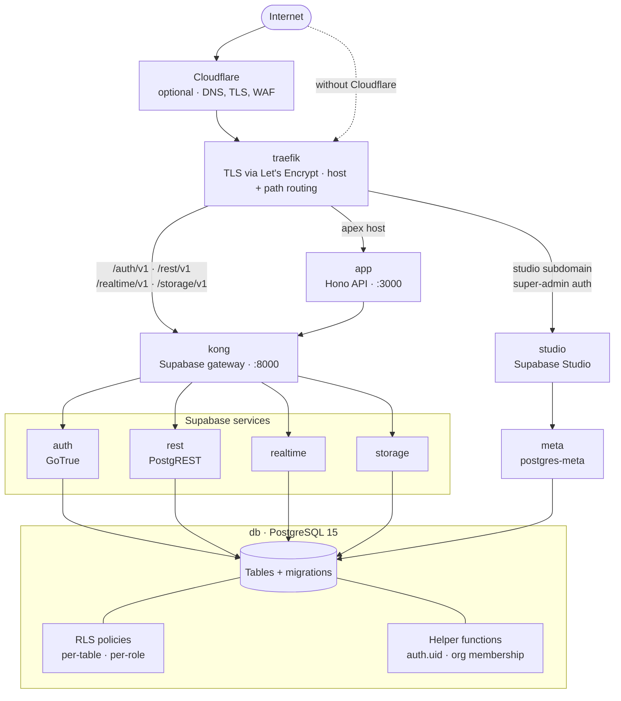

# {{PROJECT_NAME}}

A full-stack application: a React 19 single-page app, a Hono API, and self-hosted Supabase for auth, data, storage, and realtime. Authentication, multi-provider billing, multi-tenant organizations, an admin panel, transactional email, MDX content, and background jobs are already wired together and running against a real database. The same CLI that scaffolded this project also deploys and operates it, from a single Docker Compose server through multi-region Kubernetes, on Hetzner Cloud, DigitalOcean, Linode, Vultr, or Scaleway.

## Quick Start

Install the Vibecarbon CLI globally (once), then start everything with a single command:

```bash
npm install -g vibecarbon
vibecarbon up
```

`up` starts the Docker services, runs the database migrations, and launches both dev servers.

| Surface | URL |
|---------|-----|
| App | http://app.localhost (or http://localhost:5173) |
| API | http://localhost:3000 |
| API docs | http://localhost:3000/api/docs |
| Supabase Studio | http://studio.localhost |
| Traefik dashboard | http://traefik.localhost |

Sign in with the admin email and password you chose during `vibecarbon create`.

## Tech Stack

| Layer | Technology | Purpose |
|-------|------------|---------|
| Frontend | React 19, Vite, React Router, TanStack Query, Shadcn UI, Tailwind CSS v4, i18next | SPA with client-side routing, UI components, and i18n |
| Backend | Hono, Pino logger, Zod validation | Lightweight API server |
| Database | PostgreSQL | Self-hosted Supabase + RLS |
| Auth | Supabase Auth | Email, OAuth, magic links, MFA, & SSO |
| Security | Traefik, Cloudflare (optional) | TLS termination, host and path routing, admin-surface auth in production |
| Automation | Node, Docker, K8s, Pulumi | Auto scaling, Backups, Failover, High Availability |
| Tooling | Biome (lint/format), TypeScript, Vitest | Linting, formatting, type checking, and tests |

## Architecture

Traefik is the only public entrance. It routes the apex host to the Hono API, path-routes the Supabase APIs to Kong, and puts super-admin auth in front of Studio. The API reaches data through Kong with the Supabase client rather than a direct database connection, so every request arrives at PostgreSQL through the same gateway and the same policies.



## Features

- **Auth**: Email/password, OAuth (Google, Microsoft, GitHub, Apple, Discord), magic links, MFA
- **Billing**: Multi-provider (Stripe, Paddle, Polar) subscriptions, checkout, portal, plan gating, webhooks
- **Teams**: Multi-tenant organizations with RBAC (Owner, Admin, Member)
- **Admin Panel**: User management, org management, notifications, jobs, contact, newsletter, impersonation, infrastructure dashboard
- **Onboarding**: Guided wizard (profile, organization, plan, invite)
- **Background Jobs**: Scheduled tasks via pg_cron (zero extra infrastructure)

<details>
<summary><strong>…and 13 more</strong>: content, uploads, email, newsletter, docs visibility, i18n, analytics, SEO, AI rules</summary>

- **Contact Form**: Public form with honeypot spam protection, admin panel for submissions
- **Newsletter**: Double opt-in subscription, admin compose/send, CSV export
- **File Uploads**: Drag-and-drop uploads with avatar support, backed by S3-compatible object storage on your deploy provider (Hetzner Object Storage, DigitalOcean Spaces, Linode/Vultr/Scaleway Object Storage)
- **Email**: Transactional email via SMTP — welcome, invite, billing, contact notifications
- **Blog**: MDX-powered blog with frontmatter, auto-generated sitemap and RSS
- **Changelog**: MDX-powered changelog with version tags
- **Documentation**: MDX-powered docs with sidebar navigation, full-text search (Cmd+K), and prev/next links
- **Documentation Visibility**: Super-admin toggles in Admin → Settings for the User Docs surface (`/docs`) and the API Docs surface (`/api/docs` and `/api/openapi.json`); both default to on
- **Legal Pages**: Privacy policy and terms of service with placeholder support
- **i18n**: Internationalized throughout, ships English-only; add languages with `vibecarbon configure globalization`
- **Analytics**: Privacy-friendly product analytics via Plausible (cookie-free, no cross-site tracking)
- **SEO**: Meta tags, Open Graph, sitemap.xml, robots.txt, RSS feed
- **AI-Ready**: Pre-configured rules for Claude Code, Cursor, Windsurf, and GitHub Copilot

</details>

## Commands

```bash
# Development
npm run dev:start       # Full cold start (Docker + migrations + dev)
npm run dev             # Start dev servers only
npm run dev:reset       # Remove containers, volumes, and built images

# Build & Test
npm run build           # Build for production
npm run lint            # Run Biome linter
npm run typecheck       # TypeScript type checking
npm test                # Run tests
npm run test:prepush    # Lint + unit + component + integration

# Docker
npm run docker:up       # Start Supabase services
npm run docker:down     # Stop services
npm run db:migrate      # Run SQL migrations
```

## Project Structure

<details>
<summary>Directory tree</summary>

```
src/
├── client/                  # React SPA
│   ├── components/          # UI components (50+ Shadcn components)
│   │   ├── ui/              # Shadcn UI primitives
│   │   ├── auth/            # AuthProvider, ProtectedRoute
│   │   ├── FileUpload.tsx   # Drag-and-drop file upload
│   │   └── ImpersonationBanner.tsx
│   ├── pages/               # Route pages
│   │   ├── Blog.tsx         # MDX blog (index + posts)
│   │   ├── Changelog.tsx    # MDX changelog
│   │   ├── Docs.tsx         # MDX docs with sidebar nav
│   │   ├── Onboarding.tsx   # Multi-step onboarding wizard
│   │   ├── admin/           # Super admin pages
│   │   ├── settings/        # User settings (profile, billing, security)
│   │   └── organizations/   # Org details, members
│   ├── hooks/               # Custom React hooks
│   ├── lib/                 # Supabase client, i18n, blog/docs loaders
│   └── locales/             # Translation files (en.json)
│
├── server/                  # Hono API
│   ├── routes/              # API endpoints
│   │   ├── v1/              # Versioned API (users, orgs, billing, admin)
│   │   └── webhooks/        # Billing webhooks (Stripe, Paddle, Polar)
│   ├── emails/              # React Email templates
│   └── lib/                 # Server utilities (env, logger, stripe, email)
│
└── shared/                  # Shared TypeScript types & pricing config

content/
├── blog/                    # Blog posts (MDX with frontmatter)
├── changelog/               # Changelog entries (MDX with version tags)
└── docs/                    # Documentation pages (MDX with ordering)

supabase/
└── migrations/              # SQL migration files
```

</details>

## Deployment

```bash
vibecarbon deploy
```

The bare command opens a guided prompt for environment, provider, region, and deploy mode, then provisions the infrastructure, ships the images, and configures TLS. Not every cloud offers every mode:

| Provider | `compose` | `compose-ha` | `k8s` | `k8s-ha` |
|----------|:---------:|:------------:|:-----:|:--------:|
| Hetzner Cloud | ✅ | ✅ | ✅ | ✅ |
| DigitalOcean | ✅ | ✅ | ✅ | ✅ |
| Linode | ✅ | ✅ | — | — |
| Vultr | ✅ | ✅ | — | — |
| Scaleway | ✅ | ✅ | — | — |

`k8s-ha` (multi-region Kubernetes with one-command failover) runs on Hetzner and DigitalOcean today.

An environment is bound to the provider it was first deployed with, and `-provider` picks that cloud for a new one. The in-app guide at `/docs/deployment` (source: `content/docs/deployment.mdx`) covers regions, API tokens, backups, and the HA flags in full. [PRODUCTION.md](./PRODUCTION.md) covers what changes between local development and a production deployment, and [k8s/README.md](./k8s/README.md) covers the Kubernetes manifests, autoscaling, and HA clusters.

## Documentation

| Document | What's in it |
|----------|--------------|
| [AGENTS.md](./AGENTS.md) | Development patterns, architecture, and mandatory security rules (also the source for CLAUDE.md / Copilot / Cursor instructions) |
| [DEVELOPMENT.md](./DEVELOPMENT.md) | Running the stack locally and iterating on it |
| [PRODUCTION.md](./PRODUCTION.md) | What changes between local development and a production deployment |
| [TESTING.md](./TESTING.md) | The test tiers, what each one proves, and how to run them |
| [k8s/README.md](./k8s/README.md) | Kubernetes manifests, autoscaling, worker bounds, and HA clusters |
| In-app docs at `/docs` | The guides this project ships to its own users (`content/docs/*.mdx`) |

## Running Multiple Projects

To run multiple vibecarbon projects simultaneously on the same machine, configure port offsets in `.env.local`:

```bash
# Shift all ports by 100 (Vite: 5273, API: 3100, Kong: 8100)
DEV_PORT_OFFSET=100
```

Or override individual ports:

```bash
DEV_VITE_PORT=5273
DEV_API_PORT=3100
DEV_KONG_PORT=8100
```

| Service | Default | With Offset 100 |
|---------|---------|-----------------|
| Vite | 5173 | 5273 |
| API | 3000 | 3100 |
| Kong | 8000 | 8100 |
| Traefik | 80 | 180 |

## Default Credentials

The admin account created during setup:
- **Email**: (provided during `vibecarbon create`)
- **Password**: (provided during `vibecarbon create`)

This account has `super_admin` role for accessing `/admin/*` routes.
